# L'arborescence de l'application web ArtRights (Laravel)

---

## Scénario 1 : Super Admin — Connexion et Dashboard

```mermaid
flowchart TD
    %% ════════════════════════════════════════════════════
    %%  AUTHENTIFICATION
    %% ════════════════════════════════════════════════════
    AUTH["🔐 Page d'Authentification"]
    AUTH -->|Connexion| LOGIN["📋 Formulaire de Connexion<br/><i>/login</i>"]
    AUTH -->|Inscription| REG["📝 Formulaire d'Inscription<br/><i>/register</i><br/><small>Réservé aux Artistes</small>"]

    LOGIN -->|"Vérification rôle = super_admin"| REDIRECT["⚙️ Redirection automatique<br/>selon le rôle"]
    REDIRECT -->|super_admin| DASH

    %% ════════════════════════════════════════════════════
    %%  DASHBOARD SUPER ADMIN
    %% ════════════════════════════════════════════════════
    DASH["🏠 Dashboard Super Admin<br/><i>/superadmin/dashboard</i>"]

    DASH --> AGENCIES
    DASH --> WILAYAS
    DASH --> CATEGORIES
    DASH --> DEVICES
    DASH --> PVS_SA
    DASH --> USERS_SA
    DASH --> COMPLAINTS_SA
    DASH --> REPORTS_SA
    DASH --> LAW_SA
    DASH --> FOOTER
    DASH --> NOTIF_SA
    DASH --> PROFILE_SA

    %% ════════════════════════════════════════════════════
    %%  GESTION DES AGENCES
    %% ════════════════════════════════════════════════════
    AGENCIES["🏢 Gestion des Agences<br/><i>/superadmin/agencies</i>"]
    AGENCIES --> AG_CREATE["➕ Créer une Agence"]
    AGENCIES --> AG_SHOW["👁️ Détails d'une Agence"]
    AG_SHOW --> AG_BANK["🏦 Modifier Compte Bancaire"]
    AG_SHOW --> AG_ADMIN["👤 Assigner / Retirer Admin"]
    AG_SHOW --> AG_GEST["👥 Ajouter / Retirer Gestionnaire"]
    AG_SHOW --> AG_AGENT["🕵️ Ajouter / Retirer Agent"]
    AG_SHOW --> AG_TRANSFER_ADMIN["🔄 Transférer Admin"]
    AG_SHOW --> AG_TRANSFER_GEST["🔄 Transférer Gestionnaire"]
    AG_SHOW --> AG_TRANSFER_AGENT["🔄 Transférer Agent"]
    AG_SHOW --> AG_TRANSFER_ARTIST["🔄 Transférer Artiste"]

    %% ════════════════════════════════════════════════════
    %%  GESTION DES WILAYAS
    %% ════════════════════════════════════════════════════
    WILAYAS["🗺️ Gestion des Wilayas<br/><i>/superadmin/wilayas</i>"]
    WILAYAS --> WIL_SHOW["📍 Détails Wilaya"]
    WIL_SHOW --> WIL_CREATE_AG["➕ Créer Agence pour Wilaya"]

    %% ════════════════════════════════════════════════════
    %%  GESTION DES CATÉGORIES
    %% ════════════════════════════════════════════════════
    CATEGORIES["🏷️ Gestion des Catégories<br/><i>/superadmin/categories</i>"]
    CATEGORIES --> CAT_CREATE["➕ Créer Catégorie"]
    CATEGORIES --> CAT_EDIT["✏️ Modifier Catégorie"]
    CATEGORIES --> CAT_DELETE["🗑️ Supprimer Catégorie"]

    %% ════════════════════════════════════════════════════
    %%  TYPES D'APPAREILS & MONTANTS
    %% ════════════════════════════════════════════════════
    DEVICES["📱 Types d'Appareils & Montants<br/><i>/superadmin/device-types</i>"]
    DEVICES --> DEV_CREATE["➕ Créer Type"]
    DEVICES --> DEV_EDIT["✏️ Modifier Type"]
    DEVICES --> DEV_DELETE["🗑️ Supprimer Type"]

    %% ════════════════════════════════════════════════════
    %%  PROCÈS-VERBAUX (PV)
    %% ════════════════════════════════════════════════════
    PVS_SA["📄 Procès-Verbaux<br/><i>/superadmin/pvs</i>"]
    PVS_SA --> PV_VIEW["👁️ Consulter un PV"]

    %% ════════════════════════════════════════════════════
    %%  GESTION DES UTILISATEURS
    %% ════════════════════════════════════════════════════
    USERS_SA["👥 Gestion des Utilisateurs"]
    USERS_SA --> ADMINS_SA["👔 Administrateurs"]
    ADMINS_SA --> ADM_CREATE["➕ Créer Admin"]
    ADMINS_SA --> ADM_DELETE["🗑️ Supprimer Admin"]
    ADMINS_SA --> ADM_TRANSFER["🔄 Créer Admin depuis Transfert"]

    USERS_SA --> GEST_SA["📊 Gestionnaires"]
    GEST_SA --> GEST_CREATE_SA["➕ Créer Gestionnaire"]
    GEST_SA --> GEST_DELETE_SA["🗑️ Supprimer Gestionnaire"]

    USERS_SA --> TRANSFER_SA["🔄 Transfert de Personnel<br/><i>/superadmin/transfer-workers</i>"]
    TRANSFER_SA --> TR_BY_ID["Transférer par ID"]
    TRANSFER_SA --> TR_BY_EMAIL["Transférer par Email"]
    TRANSFER_SA --> TR_DELETE_USER["🗑️ Supprimer Utilisateur"]

    %% ════════════════════════════════════════════════════
    %%  SYSTÈME DE RÉCLAMATIONS
    %% ════════════════════════════════════════════════════
    COMPLAINTS_SA["📩 Réclamations<br/><i>/superadmin/complaints</i>"]
    COMPLAINTS_SA --> COMP_LIST_SA["📋 Liste des Réclamations"]
    COMPLAINTS_SA --> COMP_SHOW_SA["👁️ Détails Réclamation"]
    COMPLAINTS_SA --> COMP_RESPOND_SA["💬 Répondre"]
    COMPLAINTS_SA --> COMP_RESOLVE_SA["✅ Résoudre"]
    COMPLAINTS_SA --> COMP_DELETE_SA["🗑️ Supprimer"]

    %% ════════════════════════════════════════════════════
    %%  SYSTÈME DE RAPPORTS
    %% ════════════════════════════════════════════════════
    REPORTS_SA["📊 Rapports<br/><i>/superadmin/reports</i>"]
    REPORTS_SA --> REP_LIST_SA["📋 Liste des Rapports"]
    REPORTS_SA --> REP_SHOW_SA["👁️ Détails Rapport"]
    REPORTS_SA --> REP_RESPOND_SA["💬 Répondre"]
    REPORTS_SA --> REP_RESOLVE_SA["✅ Résoudre"]

    %% ════════════════════════════════════════════════════
    %%  GESTION DU CONTENU JURIDIQUE
    %% ════════════════════════════════════════════════════
    LAW_SA["⚖️ Contenu Juridique<br/><i>/superadmin/law</i>"]
    LAW_SA --> LAW_EDIT_SA["✏️ Modifier le Contenu"]

    %% ════════════════════════════════════════════════════
    %%  PARAMÈTRES DU FOOTER
    %% ════════════════════════════════════════════════════
    FOOTER["🔧 Paramètres du Footer<br/><i>/superadmin/footer-settings</i>"]
    FOOTER --> FOOTER_UPDATE["✏️ Modifier Footer"]

    %% ════════════════════════════════════════════════════
    %%  NOTIFICATIONS
    %% ════════════════════════════════════════════════════
    NOTIF_SA["🔔 Notifications<br/><i>/superadmin/notifications</i>"]
    NOTIF_SA --> NOTIF_READ_SA["✔️ Marquer comme lu"]
    NOTIF_SA --> NOTIF_ALL_SA["✔️✔️ Tout marquer comme lu"]
    NOTIF_SA --> NOTIF_VIEW_SA["👁️ Voir et Rediriger"]
    NOTIF_SA --> NOTIF_DEL_SA["🗑️ Supprimer"]

    %% ════════════════════════════════════════════════════
    %%  PROFIL
    %% ════════════════════════════════════════════════════
    PROFILE_SA["👤 Mon Profil<br/><i>/superadmin/profile</i>"]
    PROFILE_SA --> PROF_UPDATE_SA["✏️ Modifier Profil"]

    %% ════════════════════════════════════════════════════
    %%  STYLES
    %% ════════════════════════════════════════════════════
    classDef auth fill:#e74c3c,stroke:#c0392b,color:#fff,stroke-width:2px
    classDef dashboard fill:#2c3e50,stroke:#1a252f,color:#fff,stroke-width:3px,font-size:16px
    classDef module fill:#3498db,stroke:#2980b9,color:#fff,stroke-width:2px
    classDef action fill:#1abc9c,stroke:#16a085,color:#fff,stroke-width:1px
    classDef danger fill:#e74c3c,stroke:#c0392b,color:#fff,stroke-width:1px
    classDef transfer fill:#f39c12,stroke:#e67e22,color:#fff,stroke-width:1px
    classDef neutral fill:#95a5a6,stroke:#7f8c8d,color:#fff,stroke-width:1px

    class AUTH,LOGIN,REG auth
    class DASH dashboard
    class AGENCIES,WILAYAS,CATEGORIES,DEVICES,PVS_SA,USERS_SA,COMPLAINTS_SA,REPORTS_SA,LAW_SA,FOOTER,NOTIF_SA,PROFILE_SA module
    class AG_CREATE,AG_SHOW,AG_BANK,AG_ADMIN,AG_GEST,AG_AGENT,WIL_SHOW,WIL_CREATE_AG,CAT_CREATE,CAT_EDIT,DEV_CREATE,DEV_EDIT,PV_VIEW,ADM_CREATE,GEST_CREATE_SA,ADMINS_SA,GEST_SA,TRANSFER_SA,COMP_LIST_SA,COMP_SHOW_SA,COMP_RESPOND_SA,COMP_RESOLVE_SA,REP_LIST_SA,REP_SHOW_SA,REP_RESPOND_SA,REP_RESOLVE_SA,LAW_EDIT_SA,FOOTER_UPDATE,NOTIF_READ_SA,NOTIF_ALL_SA,NOTIF_VIEW_SA,PROF_UPDATE_SA,TR_BY_ID,TR_BY_EMAIL action
    class CAT_DELETE,DEV_DELETE,ADM_DELETE,GEST_DELETE_SA,COMP_DELETE_SA,NOTIF_DEL_SA,TR_DELETE_USER danger
    class AG_TRANSFER_ADMIN,AG_TRANSFER_GEST,AG_TRANSFER_AGENT,AG_TRANSFER_ARTIST,ADM_TRANSFER transfer
    class REDIRECT neutral
```

---

## Scénario 2 : Gestionnaire — Connexion et Fonctionnalités

```mermaid
flowchart TD
    %% ════════════════════════════════════════════════════
    %%  AUTHENTIFICATION
    %% ════════════════════════════════════════════════════
    AUTH2["🔐 Page d'Authentification"]
    AUTH2 -->|Connexion| LOGIN2["📋 Formulaire de Connexion<br/><i>/login</i>"]

    LOGIN2 -->|"Vérification rôle = gestionnaire"| REDIRECT2["⚙️ Redirection automatique<br/>selon le rôle"]
    REDIRECT2 -->|gestionnaire| DASH2

    %% ════════════════════════════════════════════════════
    %%  DASHBOARD GESTIONNAIRE
    %% ════════════════════════════════════════════════════
    DASH2["🏠 Dashboard Gestionnaire<br/><i>/gestionnaire/dashboard</i>"]

    DASH2 --> ARTWORKS_G
    DASH2 --> MISSIONS_G
    DASH2 --> PVS_G
    DASH2 --> WALLET_G
    DASH2 --> WALLET_RECHARGE_G
    DASH2 --> AGENTS_G
    DASH2 --> AGENCIES_G
    DASH2 --> COMPLAINTS_G
    DASH2 --> REPORTS_G
    DASH2 --> LAW_G
    DASH2 --> NOTIF_G
    DASH2 --> PROFILE_G

    %% ════════════════════════════════════════════════════
    %%  GESTION DES ŒUVRES D'ART
    %% ════════════════════════════════════════════════════
    ARTWORKS_G["🎨 Gestion des Œuvres<br/><i>/gestionnaire/artworks</i>"]
    ARTWORKS_G --> ART_SHOW["👁️ Détails de l'Œuvre"]
    ARTWORKS_G --> ART_DOWNLOAD["⬇️ Télécharger l'Œuvre"]
    ART_SHOW --> ART_APPROVE["✅ Approuver l'Œuvre"]
    ART_SHOW --> ART_REJECT["❌ Rejeter l'Œuvre"]

    %% ════════════════════════════════════════════════════
    %%  GESTION DES MISSIONS
    %% ════════════════════════════════════════════════════
    MISSIONS_G["📋 Gestion des Missions<br/><i>/gestionnaire/missions</i>"]
    MISSIONS_G --> MIS_CREATE["➕ Créer une Mission"]
    MISSIONS_G --> MIS_SHOW["👁️ Détails Mission"]
    MIS_SHOW --> MIS_STATUS["🔄 Modifier Statut"]
    MIS_SHOW --> MIS_ASSIGN["👤 Assigner un Agent"]
    MIS_SHOW --> MIS_PRINT["🖨️ Imprimer Mission"]

    %% ════════════════════════════════════════════════════
    %%  GESTION DES PROCÈS-VERBAUX
    %% ════════════════════════════════════════════════════
    PVS_G["📄 Procès-Verbaux<br/><i>/gestionnaire/pvs</i>"]
    PVS_G --> PV_SHOW_G["👁️ Détails du PV"]
    PV_SHOW_G --> PV_FINALIZE["✅ Finaliser le PV"]

    %% ════════════════════════════════════════════════════
    %%  PORTEFEUILLE AGENCE
    %% ════════════════════════════════════════════════════
    WALLET_G["💰 Portefeuille de l'Agence<br/><i>/gestionnaire/wallet</i>"]
    WALLET_G --> WAL_CONFIRM["✅ Confirmer Paiement PV"]
    WALLET_G --> WAL_RELEASE["💸 Libérer Paiement PV"]

    %% ════════════════════════════════════════════════════
    %%  DEMANDES DE RECHARGE
    %% ════════════════════════════════════════════════════
    WALLET_RECHARGE_G["🔋 Demandes de Recharge<br/><i>/gestionnaire/wallet-recharge</i>"]
    WALLET_RECHARGE_G --> WR_LIST["📋 Liste des Demandes"]
    WALLET_RECHARGE_G --> WR_SHOW["👁️ Détails Demande"]
    WR_SHOW --> WR_APPROVE["✅ Approuver la Recharge"]
    WR_SHOW --> WR_REJECT["❌ Rejeter la Recharge"]

    %% ════════════════════════════════════════════════════
    %%  GESTION DES AGENTS
    %% ════════════════════════════════════════════════════
    AGENTS_G["🕵️ Gestion des Agents<br/><i>/gestionnaire/agents</i>"]
    AGENTS_G --> AGT_CREATE["➕ Créer un Agent"]
    AGENTS_G --> AGT_LIST["📋 Liste des Agents"]

    %% ════════════════════════════════════════════════════
    %%  CONSULTATION DES AGENCES
    %% ════════════════════════════════════════════════════
    AGENCIES_G["🏢 Consulter les Agences<br/><i>/gestionnaire/agencies</i>"]

    %% ════════════════════════════════════════════════════
    %%  SYSTÈME DE RÉCLAMATIONS
    %% ════════════════════════════════════════════════════
    COMPLAINTS_G["📩 Réclamations<br/><i>/gestionnaire/complaints</i>"]
    COMPLAINTS_G --> CG_INBOX["📥 Boîte de Réception"]
    COMPLAINTS_G --> CG_SENT["📤 Réclamations Envoyées"]
    COMPLAINTS_G --> CG_CREATE["➕ Créer Réclamation"]
    COMPLAINTS_G --> CG_SHOW["👁️ Détails Réclamation"]
    CG_SHOW --> CG_TAKE["🤚 Prendre en Charge"]
    CG_SHOW --> CG_STATUS["🔄 Modifier Statut"]
    CG_SHOW --> CG_RESPOND["💬 Répondre"]
    CG_SHOW --> CG_DELETE["🗑️ Supprimer"]

    %% ════════════════════════════════════════════════════
    %%  SYSTÈME DE RAPPORTS
    %% ════════════════════════════════════════════════════
    REPORTS_G["📊 Rapports<br/><i>/gestionnaire/reports</i>"]
    REPORTS_G --> RG_INBOX["📥 Boîte de Réception"]
    REPORTS_G --> RG_SENT["📤 Rapports Envoyés"]
    REPORTS_G --> RG_CREATE["➕ Créer Rapport"]
    REPORTS_G --> RG_SHOW["👁️ Détails Rapport"]
    RG_SHOW --> RG_RESPOND["💬 Répondre au Rapport"]

    %% ════════════════════════════════════════════════════
    %%  RÉFÉRENCE JURIDIQUE
    %% ════════════════════════════════════════════════════
    LAW_G["⚖️ Référence Juridique<br/><i>/gestionnaire/law</i>"]

    %% ════════════════════════════════════════════════════
    %%  NOTIFICATIONS
    %% ════════════════════════════════════════════════════
    NOTIF_G["🔔 Notifications<br/><i>/gestionnaire/notifications</i>"]
    NOTIF_G --> NG_READ["✔️ Marquer comme lu"]
    NOTIF_G --> NG_ALL["✔️✔️ Tout marquer comme lu"]
    NOTIF_G --> NG_VIEW["👁️ Voir et Rediriger"]
    NOTIF_G --> NG_DEL["🗑️ Supprimer"]

    %% ════════════════════════════════════════════════════
    %%  PROFIL
    %% ════════════════════════════════════════════════════
    PROFILE_G["👤 Mon Profil<br/><i>/gestionnaire/profile</i>"]
    PROFILE_G --> PG_UPDATE["✏️ Modifier Profil"]

    %% ════════════════════════════════════════════════════
    %%  STYLES
    %% ════════════════════════════════════════════════════
    classDef auth fill:#e74c3c,stroke:#c0392b,color:#fff,stroke-width:2px
    classDef dashboard fill:#2c3e50,stroke:#1a252f,color:#fff,stroke-width:3px,font-size:16px
    classDef module fill:#9b59b6,stroke:#8e44ad,color:#fff,stroke-width:2px
    classDef action fill:#1abc9c,stroke:#16a085,color:#fff,stroke-width:1px
    classDef approve fill:#27ae60,stroke:#229954,color:#fff,stroke-width:1px
    classDef reject fill:#e74c3c,stroke:#c0392b,color:#fff,stroke-width:1px
    classDef neutral fill:#95a5a6,stroke:#7f8c8d,color:#fff,stroke-width:1px

    class AUTH2,LOGIN2 auth
    class DASH2 dashboard
    class ARTWORKS_G,MISSIONS_G,PVS_G,WALLET_G,WALLET_RECHARGE_G,AGENTS_G,AGENCIES_G,COMPLAINTS_G,REPORTS_G,LAW_G,NOTIF_G,PROFILE_G module
    class ART_SHOW,ART_DOWNLOAD,MIS_CREATE,MIS_SHOW,MIS_STATUS,MIS_ASSIGN,MIS_PRINT,PV_SHOW_G,WAL_CONFIRM,WAL_RELEASE,WR_LIST,WR_SHOW,AGT_CREATE,AGT_LIST,CG_INBOX,CG_SENT,CG_CREATE,CG_SHOW,CG_TAKE,CG_STATUS,CG_RESPOND,RG_INBOX,RG_SENT,RG_CREATE,RG_SHOW,RG_RESPOND,NG_READ,NG_ALL,NG_VIEW,PG_UPDATE action
    class ART_APPROVE,PV_FINALIZE,WR_APPROVE approve
    class ART_REJECT,WR_REJECT,CG_DELETE,NG_DEL reject
    class REDIRECT2 neutral
```

---

> **Note :** Ces diagrammes représentent l'arborescence complète de l'application ArtRights basée sur les routes réelles définies dans `routes/web.php`. Chaque nœud correspond à une page ou une action accessible dans l'interface.
